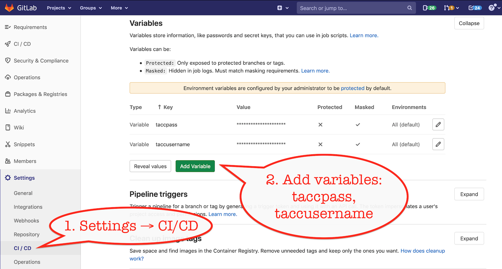

## Contributor guidelines

- Be respectful
- Be constructive
- Be kind


## Submitting Code

Our CI pipeline runs:

- [elm-format](https://github.com/avh4/elm-format) (to ensure that contributions comply with the   
  [Elm Style Guide](https://elm-lang.org/docs/style-guide)
- [elm-analyse](https://stil4m.github.io/elm-analyse/)
  
 Please use `elm-format` and `elm-analyse` before you submit a merge request:
 
 ```bash
 npm install
 npm run elm:format
 npm run elm:analyse
 ```


## End-to-end browser tests

Our CI pipeline also runs end-to-end tests with real browsers. For these tests to work you need:

1. Access to a Jetstream allocation
2. Valid TACC (Texas Advanced Computing Center) credentials
3. Set `taccusername` and `taccpass` environment variables in the GitLab CI/CD settings of your own fork of Exosphere

Ask the maintainers for testing credentials if you don't have a Jetstream allocation.

How to add TACC credentials as environment variables to your GitLab repository settings:



There are subtle but important differences between how the pipeline runs end-to-end browser tests for merge requests, as opposed to `master` and `dev` branches:

**Merge requests:** Compiled Exosphere assets from the `elm_make` stage is combined with Selenium and a headless browser in a custom container, and the tests point at Exosphere served by this container. (See the `.build_with_kaniko`-based jobs in the `dockerize` stage.) Browser tests for merge requests run in the `test` stage along with the other tests (like Elm unit tests, `elm-analyze`, etc.).

**master and dev branches:** The `dockerize` stage is skipped, and the browser tests are run in the `postdeploy` stage (_after_ the `deploy` stage). The browser tests in the `postdeploy` stage use the standard, unmodified Selenium container image (does _not_ contain any Exosphere assets). For the `master` branch the browser tests run against production environments ([https://try.exosphere.app/](https://try.exosphere.app/) and [https://exosphere.jetstream-cloud.org/](https://exosphere.jetstream-cloud.org/)) and tests for the `dev` branch run against the development environment ([https://try-dev.exosphere.app/](https://try-dev.exosphere.app/)).


## Architecture Decisions

We use lightweight architecture decision records. See: <https://adr.github.io/>

Our architecture decisions are documented in: [docs/adr/README.md](docs/adr/README.md)
