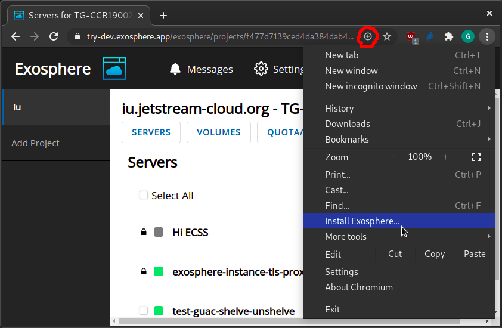
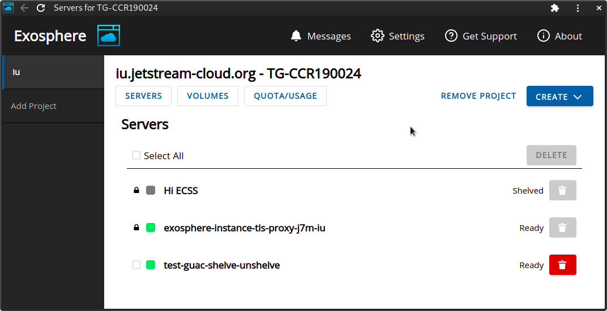
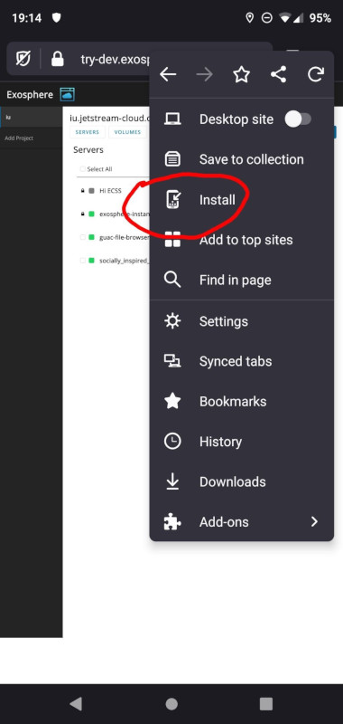
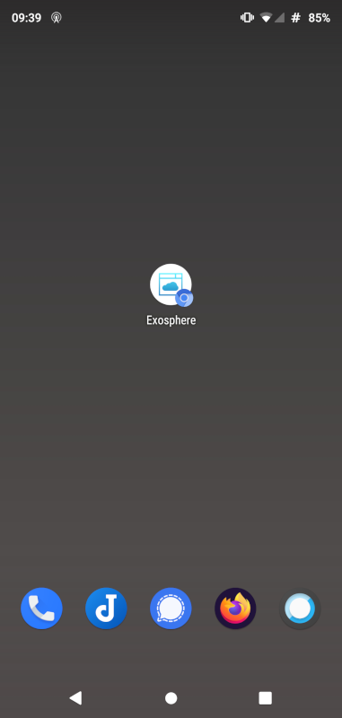
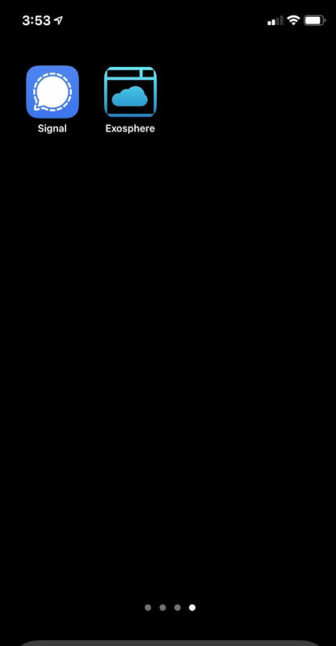

# Installing Exosphere Progressive Web Application

With [this](https://gitlab.com/exosphere/exosphere/-/merge_requests/381) change, the Electron-based Exosphere desktop application is deprecated in favor of the new [Progressive Web Application](https://en.wikipedia.org/wiki/Progressive_web_application) (PWA).

After March 31, 2021, the old Exosphere desktop app (that you installed from a package download) will stop working. Going forward, please use Exosphere in your browser at [try.exosphere.app](https://try.exosphere.app), or if you are a Jetstream user, please use [exosphere.jetstream-cloud.org](https://exosphere.jetstream-cloud.org).

Both of these sites are Progressive Web Applications, so if you wish, you can install them to your desktop or device home screen. This will provide an experience similar to the old desktop app, but with better security and smoother delivery of updates.

## Installing PWA on Desktop with Chrome or Chromium

Go to [try.exosphere.app](https://try.exosphere.app) or [exosphere.jetstream-cloud.org](https://exosphere.jetstream-cloud.org) in a regular (non-incognito) window. Look for the install button in your address bar, or choose "Install Exosphere..." from the 'three dots' (hamburger) menu.

You will be prompted to install Exosphere. After this, it will appear

- On Windows, as a desktop shortcut
- On Mac OS, in your Launchpad
- On common Linux distributions, in your Activities/Applications menu

When you open Exosphere from these places, it will look and feel like a desktop application.

You can manage all of your installed PWAs, including Exosphere, by browsing to `chrome://apps`.

## Installing PWA on Android

Android users can install the PWA with either Chrome/Chromium or Firefox. In either browser, go to [try.exosphere.app](https://try.exosphere.app) or [exosphere.jetstream-cloud.org](https://exosphere.jetstream-cloud.org).

If using Chromium, tap the 'three dots' (hamburger) menu, tap "Add to...", then tap "Home screen".

If using Firefox, tap the 'three dots' (hamburger) menu, and tap "Install".

In either case, you will be invited to place an Exosphere icon on your home screen, and it will look approximately like this.

## Installing PWA on iOS

Open Safari, and browse to [try.exosphere.app](https://try.exosphere.app) or [exosphere.jetstream-cloud.org](https://exosphere.jetstream-cloud.org).

Per [these](https://developer.mozilla.org/en-US/docs/Web/Progressive_web_apps/Developer_guide/Installing#safari_for_ios_iphoneos_ipados) instructions, Tap the sharing button at the bottom of the screen, and tap "Add to Home Screen". You will be prompted to confirm, and then an Exosphere icon will appear on your home screen.

